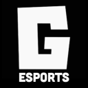
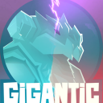
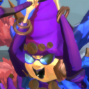

# Gigantic Discords servers


Do you want to add other discord servers? Contact me or make an issue on the [Github](https://github.com/SenorGeese/Gigantic/issues) to request any other Discord servers you'd like to see here. Thank you for helping!


## The Official GoGigantic [Discord Server](https://discord.gg/GoGigantic)

The official GoGigantic Discord server where Gearbox and Abstraction making updates, host events, and lots of the Gigantic player base resides. Discord link: [https://discord.gg/GoGigantic](https://discord.gg/GoGigantic)

<figure><figcaption>
Official GoGigantic
</figcaption></figure>

## Gigantic Heaven [Discord server](https://discord.gg/zbEeAgB)

Previously the hub for Gigantic private servers for Gigantic before Gigantic Rampage. Now turned into a huge hangout for Gigantic players. Discord link: [https://discord.gg/zbEeAgB](https://discord.gg/zbEeAgB)

<figure><figcaption>
New Gigantic Heaven
</figcaption></figure>

## Gigantic esports [Discord server](https://discord.gg/HXRJZPay5y)

Owned by Dave and Sarsy involved as the tournament organizer. A Discord server to cultivate the esports side of Gigantic. Discord link: [https://discord.gg/HXRJZPay5y](https://discord.gg/HXRJZPay5y)

&#x20;

<figure><figcaption>
Dave's esports server
</figcaption></figure>

## Gigantic Competitive [Discord server](https://discord.gg/aHpKWr2pUG)

Owned and operated by Trobo. This is a server for learning, talking, and competing in Gigantic. Trobo is planning to host tournaments in this server. Discord link: [https://discord.gg/aHpKWr2pUG](https://discord.gg/aHpKWr2pUG)

<figure><figcaption>
Trobo's competitive server
</figcaption></figure>

## flim's tech [Discord server](https://discord.com/invite/jUEKvNum9W)

Owned by flim. It's a server for learning tech/bugs/exploit both past and present. Plenty of unlisted videos of tech. Discord link: [https://discord.com/invite/jUEKvNum9W](https://discord.com/invite/jUEKvNum9W)

<figure><figcaption>
flim's tech server
</figcaption></figure>

## Gigantic Wiki [Discord server](https://discord.gg/my2T5FDqrb)

Owned by Legroom. This is a server to be the social communication center for editors and readers of the [GoGigantic wiki](https://gogigantic.wiki/) ([https://gogigantic.wiki/](https://gogigantic.wiki/)). Editing, additions, improvements, and other wiki things is up for discussion here! Discord link: [https://discord.gg/my2T5FDqrb](https://discord.gg/my2T5FDqrb)

<figure><figcaption>
Legroom's Wiki server
</figcaption></figure>
