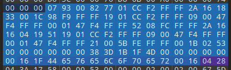
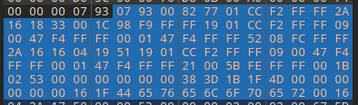
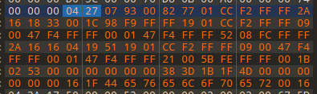

# Gigantic UPKs


Since the July 18th patch. You can no longer use this method to enable console functionality.



Remember to make backups



Still experimental and can break depending on how your hex editor manages data.


## Enabling Developer Mode/Enabling Console

Find `RxGame.upk` inside `RxGame\CookedPCConsole\`

Do `./decompress.exe -game=gigantic <Path to Package>` to decompress the upk using [https://www.gildor.org/down/47/umodel/decompress.zip](https://www.gildor.org/down/47/umodel/decompress.zip) or here [https://www.gildor.org/downloads](https://www.gildor.org/downloads).&#x20;

Using a hex editor. Find `161F446576656C6F70657200160428`**.** The last four bytes `0428` is `return false`. Cut it so that there's no blank hexes Then search for a hex value of `079300827701CC` And place it before those bytes and change it to 0427 for return true.

## Enabling Developer Mode/Enabling Console 2

Find `RxGame.upk` inside `RxGame\CookedPCConsole\`

decompress.exe is cli tool, so go where decompress.exe is located within cmd. Do `decompress.exe -game=gigantic <Path to Package>` to decompress the upk using [https://www.gildor.org/down/47/umodel/decompress.zip](https://www.gildor.org/down/47/umodel/decompress.zip) or here [https://www.gildor.org/downloads](https://www.gildor.org/downloads).&#x20;

Open your decompressed pack inside a hex editor of your choice.

Find `161F446576656C6F70657200160428`. Select the chunk.

<figure><figcaption>
Selected chunk
</figcaption></figure>

Shift (copy and paste) this chunk to the right to remove `0428`.

<figure><figcaption>
Chunk correctly shifted
</figcaption></figure>

Replace the `0793` with `0427` right before the `079300827701CCF2FFFF2A161833` string.

<figure><figcaption>
Modification
</figcaption></figure>

You don't need to compress. Just replace the file. You know it worked when you can boot into main menu or see predicted commands in console.

## Viewing the UPKs

Decompress using the decompressor from eariler.

Then you should be able to view them using [https://github.com/Dizbdeedee/UE-Explorer/releases/tag/0.0.1](https://github.com/Dizbdeedee/UE-Explorer/releases/tag/0.0.1) or  [https://github.com/Dizbdeedee/UE-Explorer](https://github.com/Dizbdeedee/UE-Explorer) to varying degrees of success.

The decompiler isn't perfect when it comes to gigantic, it fails to deserialize some stuff.

This was just a modification to UEExplorer to get the initial byte offset more-or-less correct but you'd have to make additional tweaks to the program to get it to do that.

And personally that degree of C++, C# and bytecode are beyond me. It's "good enough" to get an idea of a lot of things though

Trying to extrapolate object structures from bytecode and then figuring out how UEExplorer wants me to tell it that, with how little documentation it actually has, seems like too much of a pain.

Not worth it considering the game's actively being developed again, but it's how hosting on the original event build was cracked
