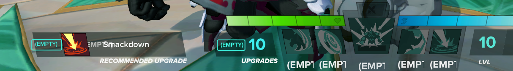
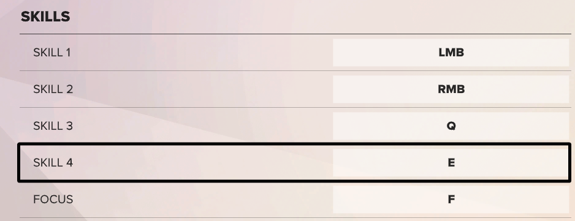
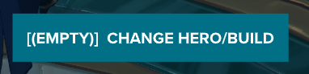
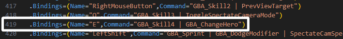
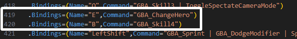
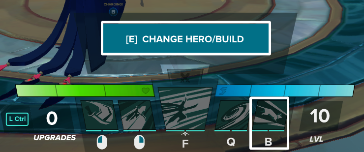

# Unable to Change Hero/Build (Fix)


Remember to make backups of the files you modify



This changes may break your keybinds if performed incorrectly.

\
If you do break your keybinds. Try replacing the file with your backup, or use the Verify Game files option in Steam


## Issue: Changing "Skill 4" keybind in-game breaks the ability to "Change Hero/Build"

<figure><figcaption>
Skill 4 keybind in settings in-game
</figcaption></figure>

<figure><figcaption>
Broken "Change Hero/Build" bug (I set keybind to "B")
</figcaption></figure>

## Fix: Changing DefaultInput.ini

There is probably another file that is better to edit, until I find that, this works to fix the bug.

Go to path: `~\Steam\steamapps\common\Mission 202\RxGame\Config`

Open `DefaultInput.ini`&#x20;

Go to line 419:

<figure><figcaption>
Line 419 of DefaultInput.ini
</figcaption></figure>

Make these changes below, changing Line 419 and adding Line 420. This edit includes creating a new line, separating the keybinds, and setting your preferred keybinds.

<figure><figcaption>
The changes in place to fix the bug which is changing
</figcaption></figure>

In the example above, I set "Change Hero/Build" to `E`, and set "Skill 4" to `B`.

<figure><figcaption>
"Change Hero/Build" is working, and E skill is set to B.
</figcaption></figure>

## Enjoy your personalized keybinds!

<figure><figcaption>
W Fix
</figcaption></figure>

## Leads:&#x20;


[adding-toggleping-keybind.md](adding-toggleping-keybind.md)



[broken-hero-build-swapping-by-ardaim.md](broken-hero-build-swapping-by-ardaim.md)

